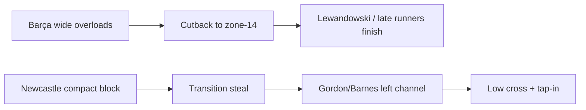

# Barcelona vs Newcastle — UCL Round of 16 (2nd leg)
**Pre-match briefing (TianShi/DiLi/RenHe)**

---
# 1) Snapshot
- First leg: **1–1** (Barnes 86' | Yamal pen 96')
- Match question: **Can Barça turn control into clean chances, before Newcastle's transition punch lands?**
- Rule note: UCL knockout **does not use away-goals**.

---
# 2) 天时 (Timing & Form)
## Barcelona
- Recent attacking momentum: strong home output (e.g., 5–2 vs Sevilla)
- UCL defensive trend: **rare clean sheets** → “one mistake = one goal” risk

## Newcastle
- Away resilience improving (e.g., 1–0 at Chelsea)
- Ceiling risk: key midfield/CB absences reduce build-up & resistance under pressure

---
# 3) 地利 (Home/Away + Matchups)
## Expected game shape
- Barça: 60%+ possession, territorial pressure, sustained waves
- Newcastle: compact block + **fast breaks** into space behind fullbacks

## Where the battle is won
- Barça wide overloads → cutbacks to zone-14 / penalty spot
- Newcastle transitions → left channel runs & early low crosses

---
# 4) 人和 (Personnel & Tactics)
## Barcelona availability (key notes)
- Out: Kounde, De Jong, Balde, Christensen
- Impact: recovery speed & midfield control may dip → transition defense is the stress test

## Newcastle availability (key notes)
- Out: Bruno Guimaraes, Fabian Schar, Lewis Miley, Emil Krafth
- Tonali: monitor fitness/illness status
- Impact: less central progression; set pieces & direct play become more important

---
# 5) Goal Hypotheses — Barcelona
| Path | Who | Zone | Method |
|---|---|---|---|
| A | **Yamal → Lewandowski** | Right half-space → 6-yard box | Through-ball / cutback |
| B | **Raphinha + Pedri** | Left wing → zone-14 | Cutback + late run |
| C | Set piece / pen | Lewandowski / aerial targets | Box | Corner second ball / penalty |

---
# 6) Goal Hypotheses — Newcastle
| Path | Who | Zone | Method |
|---|---|---|---|
| A | **Gordon / Barnes** | Left channel behind RB | Transition + low cross |
| B | Set piece chaos | CBs + runners | Near post / 2nd ball | Corner/FK scramble |

---
# 7) 3 Game Scripts
## Script A (base case)
Barça pressure → 1st goal via cutback → Newcastle chase → late tense finish

## Script B (upset path)
Newcastle scores first in transition → Barça forced into high-risk attacking → chaos game

## Script C (wildcard)
Early pen/red card changes structure → variance spikes

---
# 8) Prediction
- Lean: **Barcelona edge (medium confidence)**
- Score picks: **2–1 Barça** (backup: **1–1 → extra time risk**)
- Swing factors:
  1) Barça build-up errors under pressure
  2) Newcastle's first-pass quality in transitions (Bruno out)
  3) Set pieces & penalties

---
# 9) What to watch (simple map)

