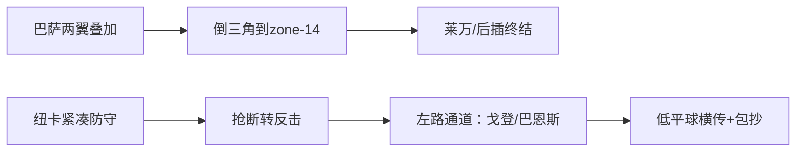

# 巴塞罗那 vs 纽卡斯尔联｜欧冠1/8决赛次回合
**赛前简报（天时/地利/人和）｜社媒卡片 16:9**

---
# 1）一句话结论
- **巴萨小优势**（信心：中等）
- 首选比分：**2-1**；备选：**1-1（加时风险）**

---
# 2）快照（Snapshot）
- 首回合：**1-1**（巴恩斯 86'｜亚马尔 点球 96'）
- 本场核心问题：
  - 巴萨能否把控球变成“干净的高质量机会”？
  - 纽卡能否用少数反击把比赛“打碎”？
- 规则提示：欧冠淘汰赛**不使用客场进球规则**。

---
# 3）天时：状态与势头
## 巴萨
- 主场进攻势头在线（代表样本：近期主场 5-2 胜塞维利亚）
- 欧冠防线零封能力不足 → “一次失误=一次丢球”的结构性风险

## 纽卡
- 客场韧性提升（代表样本：客场 1-0 胜切尔西）
- 关键中轴伤停较多 → 抗压/出球上限受影响

---
# 4）地利：比赛形态与对位区域
## 预期比赛形态
- 巴萨：60%+控球，半场围攻，持续二次进攻
- 纽卡：紧凑防守 + 快速反击，力争 2-3 脚就形成威胁

## 关键区域
- 巴萨：两翼叠加 → 倒三角到**禁区弧顶/点球点**（zone-14）
- 纽卡：打巴萨边后卫身后空间，尤其**左路通道**

---
# 5）人和：伤停与战术影响（要点）
## 巴萨
- 缺阵：孔德、德容、巴尔德、克里斯滕森
- 影响：回追速度与中场控制下降 → 转换防守是压力测试

## 纽卡
- 缺阵：吉马良斯、沙尔、麦利、克拉夫特；托纳利状态待定
- 影响：中路推进能力下降 → 更依赖直接打法与定位球

---
# 6）进球路径假设：巴萨（更可复制）
| 路径 | 可能球员 | 主要区域 | 方式 |
|---|---|---|---|
| A | **亚马尔 → 莱万** | 右肋 → 小禁区前沿 | 直塞/内切后横传/倒三角 |
| B | **拉菲尼亚 + 佩德里后插** | 左翼 → zone-14 | 强侧吸引→倒三角→后插打门 |
| C | 点球/定位球 | 禁区 | 角球二点球/点球 |

---
# 7）进球路径假设：纽卡（更依赖“少量高价值机会”）
| 路径 | 可能球员 | 主要区域 | 方式 |
|---|---|---|---|
| A | **戈登/巴恩斯** | 左路通道（身后） | 反击提速→低平球横传→包抄 |
| B | 定位球混战 | 多点冲击 | 近门柱/二点 | 角球/任意球二点球 |

---
# 8）三种比赛剧本（可审计）
- **剧本A（基准）**：巴萨围攻先开张 → 纽卡追分 → 末段高压拉锯
- **剧本B（爆冷）**：纽卡反击先得手 → 巴萨被迫提速 → 互捅局
- **剧本C（混沌）**：早球/点球/红牌 → 方差显著增大

---
# 9）预测与关注点
- 倾向：**巴萨小胜晋级**（中等信心）
- 比分：**2-1**（首选）｜**1-1（加时风险）**
- 摇摆因素Top3：
  1) 巴萨后场出球失误次数
  2) 纽卡反击第一传质量（吉马良斯缺阵影响）
  3) 定位球/点球这种“细节球”

---
# 10）一张图看懂（简化版）

