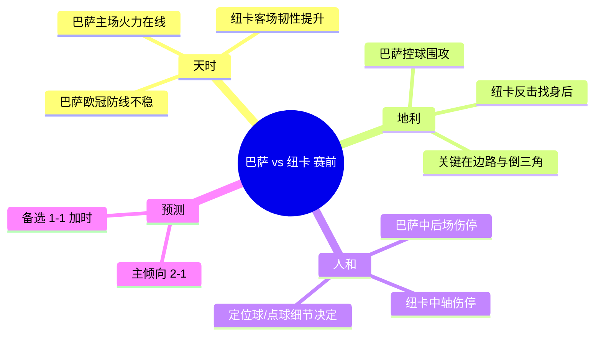

# 巴塞罗那 vs 纽卡斯尔联 — 欧冠1/8决赛次回合（赛前专业简报）

> 方法论：**天时 / 地利 / 人和** → 进球路径假设 → 剧本推演 → 比分预测。

## 0) 结论先行（可读性版）

| 项目 | 结论 |
|---|---|
| 胜平负倾向 | **巴萨小优势**（信心：中等） |
| 推荐比分区间 | **2-1**（首选）；**1-1**（备选：进入加时风险） |
| 关键摇摆因素 | ①巴萨后场出球失误 ②纽卡反击第一传质量（吉马良斯缺阵）③定位球/点球 |

---

## 1) 比赛信息（Snapshot）

- 赛事：欧冠 1/8 决赛 次回合
- 对阵：巴塞罗那 vs 纽卡斯尔联
- 首回合：1-1（巴恩斯 86'；亚马尔 点球 96'）
- 规则提示：欧冠淘汰赛 **不使用客场进球规则**。

---

## 2) 天时（状态 / 赛程 / 势头）

### 2.1 近期势头（定性）
- **巴萨**：主场进攻火力在线（近期主场 5-2 赢塞维利亚作为代表样本），能持续制造半场压迫与二次进攻。
- **纽卡**：客场韧性上升（客场 1-0 切尔西），防守专注度比“赛季平均印象”更好。

### 2.2 风险点
- 巴萨欧冠防线近期零封能力不强：意味着“对手一次高质量反击”就可能改写剧本。

---

## 3) 地利（主客场结构 / 对位区域）

### 3.1 预期比赛形态
- 巴萨：控球占优（倾向 60%+），持续压迫对手禁区前沿。
- 纽卡：低位+中位混合防守，依赖反击与定位球创造“少量但尖锐”的机会。

### 3.2 关键区域（Zone Map）
- **巴萨主要攻击区**：两翼→倒三角→禁区弧顶/点球点附近（zone-14）。
- **纽卡主要利用区**：巴萨边后卫身后空间（尤其左路通道），反击中通过低平球横传门前制造包抄。

---

## 4) 人和（伤停 / 阵型 / 战术）

> 说明：以赛前公开信息为基础，临场首发若变化需要二次校正。

### 4.1 伤停影响（结构化）

| 队伍 | 缺阵/存疑（关键） | 结构影响 |
|---|---|---|
| 巴萨 | 孔德、德容、巴尔德、克里斯滕森 | 中后场控制与回追质量下降 → **转换防守压力上升** |
| 纽卡 | 吉马良斯、沙尔、麦利、克拉夫特；托纳利状态待定 | 中轴出球与抗压下降 → 更依赖直接打法/定位球 |

### 4.2 战术要点
- 巴萨：边路叠加与肋部渗透并行，尽量把进攻做成“低风险的倒三角”。
- 纽卡：优先保证阵型密度，反击时追求“2-3脚到禁区”，避免在中场和巴萨做长时间纠缠。

---

## 5) 进球路径假设（谁 / 哪 / 怎么进）

### 5.1 巴萨（更可复制的得分方式）

| 路径 | 参与者 | 区域 | 方式 |
|---|---|---|---|
| A | **亚马尔 → 莱万** | 右肋 → 小禁区前沿 | 直塞/内切后横传/倒三角 |
| B | **拉菲尼亚 + 佩德里(后插)** | 左翼 → zone-14 | 强侧吸引→倒三角→后插打门 |
| C | 莱万/定位球点 | 禁区 | 角球二点球/点球 |

### 5.2 纽卡（更依赖“少量高价值机会”）

| 路径 | 参与者 | 区域 | 方式 |
|---|---|---|---|
| A | **戈登/巴恩斯** | 左路通道（身后） | 反击提速→低平球横传→包抄 |
| B | 多点冲击 | 定位球区域 | 角球/任意球制造混战（二点球） |

---

## 6) 剧本推演（让预测可审计）

1. **剧本A（基准）**：巴萨围攻先开张（倒三角/二次进攻）→ 纽卡追分→ 末段高压拉锯。
2. **剧本B（爆冷路径）**：纽卡反击先得手→ 巴萨被迫提速→ 防线暴露→ 比赛变“互捅局”。
3. **剧本C（混沌）**：早球/点球/红牌改变结构→ 比赛方差显著增大。

---

## 7) 比分预测

- 倾向：**巴萨 2-1 纽卡**（信心：中等）
- 备选：**1-1**（进入加时风险）

---

## 附：脑图（GitHub 可直接渲染）

