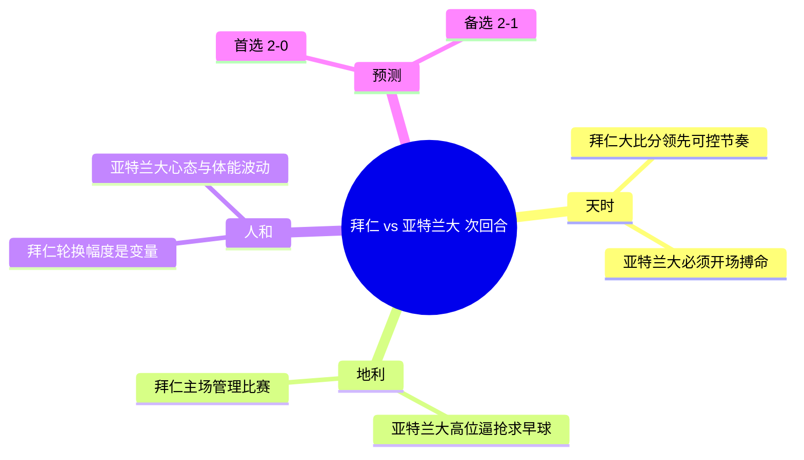

# 拜仁慕尼黑 vs 亚特兰大｜欧冠 1/8 决赛次回合（赛前专业简报）

> 方法论：**天时 / 地利 / 人和** → 进球路径假设 → 剧本推演 → 比分预测。

---

## 一、结论先行（Executive Summary）

| 项目 | 结论 |
|---|---|
| 晋级形势 | 首回合 **亚特兰大 1-6 拜仁**，次回合整体悬念较小，但仍需关注轮换与比赛强度 |
| 胜平负倾向（本场） | **拜仁不败更稳**（信心：中等偏高） |
| 比分预测 | **2-0**（首选）；**2-1**（备选） |
| 三个摇摆因素 | ①拜仁是否大幅轮换 ②亚特兰大是否开场搏命高压 ③定位球/早丢球引发的节奏失控 |

---

## 二、比赛信息（Snapshot）

- **赛事阶段**：欧冠 1/8 决赛 次回合
- **对阵**：拜仁慕尼黑 vs 亚特兰大
- **开球时间**：周三 18 March 2026 **21:00 CET**（北京时间次日 04:00，按欧冠常规时段推算）
- **场地**：Fußball Arena München（慕尼黑）
- **首回合**：亚特兰大 1-6 拜仁
- **规则提示**：欧冠淘汰赛 **不使用客场进球规则**。

---

## 三、天时：状态 / 赛程 / 势头

### 3.1 走势解读
- **拜仁**：首回合大胜带来“战术选择权”——可以更从容控制节奏，减少不必要消耗。
- **亚特兰大**：总比分大幅落后，次回合极可能采取更激进策略（开场抢、压迫、争取早进球）。

### 3.2 风险提示
- 大比分领先方的常见风险：**轮换导致中后场默契下降** + **专注度波动**。

---

## 四、地利：主客场结构 / 对位区域

### 4.1 预期比赛形态
- 拜仁：主场控节奏，优先“稳住不失球”，再伺机扩大优势。
- 亚特兰大：更可能在开场 15–25 分钟集中冲击，试图打出“早球→带节奏”。

### 4.2 关键区域
- 拜仁主要机会区：边路强侧推进→倒三角/门前包抄；以及二次进攻的禁区弧顶远射。
- 亚特兰大主要机会区：高位逼抢后制造的就地反击；以及定位球冲击门前。

---

## 五、人和：阵容 / 轮换 / 心理

### 5.1 心理与策略
- **拜仁**：目标更偏“管理比赛”——不冒险、不送反击。
- **亚特兰大**：目标更偏“搏命一段时间”——如果开场无果，后续体能与心态可能下滑。

### 5.2 轮换变量（关键）
- 若拜仁轮换幅度大：比赛更开放，亚特兰大拿到进球/制造混乱的概率上升。

---

## 六、进球路径假设（谁 / 在哪 / 怎么进）

### 6.1 拜仁（更可复制）

| 路径 | 参与者（类型） | 区域 | 方式 |
|---|---|---|---|
| A | 边锋/边后卫 + 中锋/后插 | 两翼→小禁区前沿 | 下底传中/倒三角 |
| B | 中场二次进攻 | 禁区弧顶 | 远射/二点球 |
| C | 反击终结 | 肋部/中路 | 直塞/单刀 |

### 6.2 亚特兰大（更依赖“开场强度”）

| 路径 | 参与者（类型） | 区域 | 方式 |
|---|---|---|---|
| A | 前场抢断后第一脚直塞 | 中路/肋部 | 就地反击 |
| B | 定位球冲击 | 门前 | 头球/混战二点 |

---

## 七、剧本推演

1. **剧本A（基准）**：拜仁控节奏→逐步压制→2-0 结束战斗。
2. **剧本B（亚特兰大搏命）**：亚特兰大开场高压抢到早球→比赛短时间失控→拜仁靠效率再拉开。
3. **剧本C（意外）**：早丢球/红牌/点球→比赛方差上升。

---

## 八、最终预测

- **本场倾向**：拜仁 2-0 亚特兰大（首选）
- **备选**：拜仁 2-1 亚特兰大

---

## 附录：脑图（GitHub 可直接渲染）

