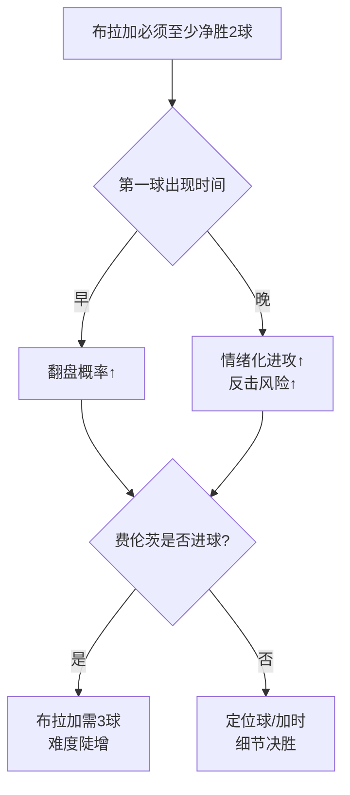

# 欧联杯快闪简报｜布拉加 vs 费伦茨瓦罗斯

（1/8决赛次回合｜北京时间 03-18 23:30）

---

## 1. 系列赛形势（30秒看懂）

- 首回合：费伦茨瓦罗斯 2-0 布拉加
- 布拉加：净胜2球→加时；净胜3球→直接晋级
- 费伦茨瓦罗斯：不败或输1球→晋级

---

## 2. 布拉加的“必须做对”三件事

1) **尽早进球**：第一球越晚，焦虑越高
2) **控球变高质量**：少盲传中，多倒三角与二点球
3) **别被反击一刀**：丢1球≈系列赛基本结束

---

## 3. 费伦茨瓦罗斯的客场策略

- 目标不是“死守90分钟”
- 更现实：
  - 先稳住前20分钟
  - 伺机打一次高质量反击/定位球
  - 争取一个客场进球把门槛抬到3球

---

## 4. 人员与变量（以临场为准）

- 布拉加：Victor Gómez 解禁回归（边路出球/回追利好）
- 布拉加：Barisic、Vitor Carvalho 仍可能缺席
- 费伦茨瓦罗斯：Zachariassen **停赛**（中场跑动与后插上少一环）

来源：Sports Mole

---

## 5. 关键人

- 布拉加：Ricardo Horta（队长，主场进球势头强）
- 费伦茨瓦罗斯：Kanichowsky / Joseph（首回合决定性得分点）

---

## 6. 最可能的比赛脚本

A) 布拉加上半场进球 → 系列赛瞬间变开放

B) 久攻不下 → 布拉加开始堆低质量射门/传中 → 反击风险飙升

C) 费伦茨瓦罗斯偷到客场球 → 布拉加需要3球 → 难度陡增

---

## 7. 进球路径看板

- 布拉加：边路强侧 → 倒三角（点球点附近终结）
- 布拉加：定位球二点球连击（别浪费高点优势）
- 费伦茨瓦罗斯：断球后第一脚向前（打身后）

---

## 8. 一张图：胜负开关

---

## 9. 我的倾向（非投注建议）

- 布拉加更可能赢球，但要“赢2球以上”非常难。
- 如果布拉加能在前30分钟进球，比赛观赏性会显著提升。

（完）
