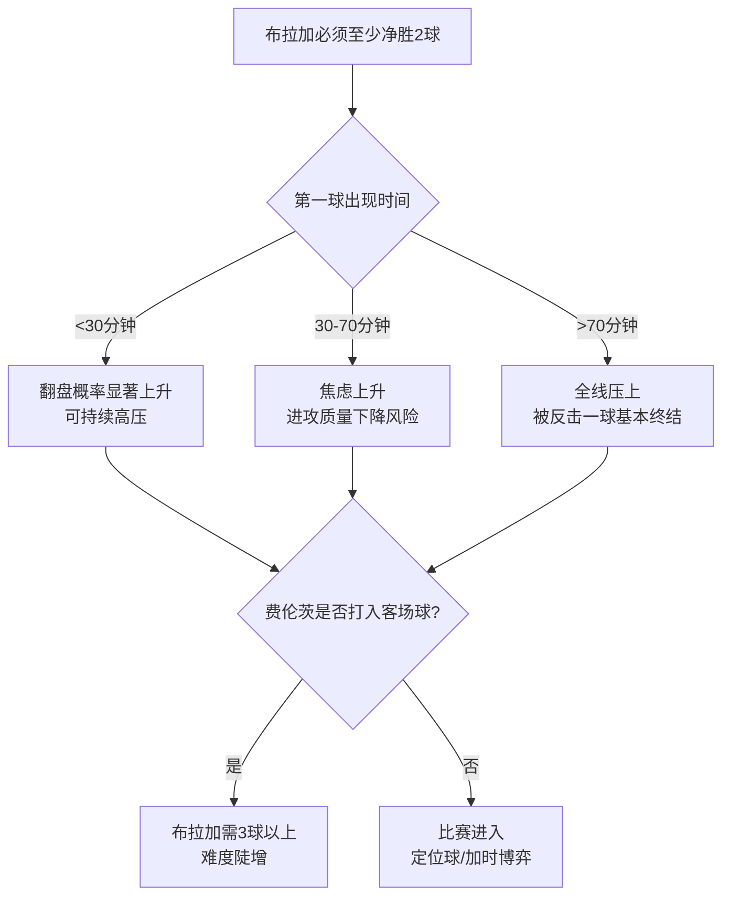

# 欧联杯赛前简报｜布拉加 vs 费伦茨瓦罗斯（1/8决赛次回合）

- **比赛**：布拉加（SC Braga） vs 费伦茨瓦罗斯（Ferencváros）
- **赛事/阶段**：2025/26 欧足联欧洲联赛（欧联杯）｜1/8决赛 次回合
- **开球时间**：**2026-03-18 23:30（北京时间）**（= 16:30 CET，来源见下）
- **场地**：Estádio Municipal de Braga
- **首回合**：费伦茨瓦罗斯 **2-0** 布拉加（2026-03-12）
- **晋级形势**：
  - 布拉加需 **净胜2球** 才能进入加时；净胜3球直接晋级
  - 费伦茨瓦罗斯保持不败或输1球即可晋级

> 信息来源（公开网络，可能随临场变化）：Sports Mole 赛前前瞻（含伤停与可能首发、首回合信息）等。

---

## 1) 一页结论（给忙人）

| 维度 | 关键结论 |
|---|---|
| 赛果压力 | 布拉加背负“至少2球”的硬指标，节奏大概率更激进，风险在于被反击/定位球再丢一球就极难翻盘。 |
| 结构对抗 | 布拉加倾向控球与边路推进；费伦茨瓦罗斯更像“效率队”——首回合在控球较少的情况下把握住关键射正得分。 |
| 人员变量 | 费伦茨瓦罗斯中场 **Kristoffer Zachariassen 停赛**（累计黄牌）；布拉加后场 **Victor Gómez 解禁回归**，利于边路出球与回追。 |
| 关键人 | 布拉加：队长 **里卡多·奥尔塔（Ricardo Horta）** 主场进球势头强；费伦茨瓦罗斯：**Gabi Kanichowsky / Lenny Joseph** 是首回合决定性得分点。 |
| 建议观赛点 | ① 布拉加前20分钟压迫强度与“第一球时间”；② 费伦茨瓦罗斯是否主动提速争取客场进球；③ 定位球攻防与二点球控制。 |

---

## 2) 首回合复盘（为什么是0-2）

- 布拉加在首回合拥有更高控球（Sports Mole 形容“几乎是对手的两倍控球”），但“控球≠高质量机会”。
- 两队射正次数接近，但费伦茨瓦罗斯由 **Kanichowsky 与 Joseph** 把握住关键瞬间，完成2球领先。

**次回合意义**：布拉加必须把“控球”转化为“禁区内的终结与二次进攻”，否则越控越急、越急越容易被打身后。

---

## 3) 近期状态（趋势判断）

> 由于不同数据站口径与更新时间不一致，下述以“趋势”为主，细节以临场官方名单与赛后数据库为准。

- **布拉加**：欧联主舞台阶段整体不差，但最近两场欧联结果不理想（Sports Mole 提及其欧联近况与主场胜场“净胜2球以上”并不多）。
- **费伦茨瓦罗斯**：Sports Mole 提到其各项赛事 **6连胜**，期间进球数可观；但其欧联客场近8场输掉5场，且有多场为2球以上失利，说明客场并非铁板一块。

---

## 4) 伤停与轮换（待确认项已标注）

| 球队 | 缺阵/存疑 | 影响解读 |
|---|---|---|
| 布拉加 | **Adrian Barisic**（中卫，腹股沟/内收肌问题）、**Vitor Carvalho**（中场，连续缺阵） | 后场与中场轮换受限；在必须提速的前提下，回追与保护禁区弧顶尤其关键。 |
| 布拉加 | **Victor Gómez**（首回合停赛，本场回归） | 右路出球/套边质量提升，对“边路+肋部二过一”很重要。 |
| 布拉加 | **Amine El Ouazzani**（脚部伤后复出，可能替补） | 若落后或需要高空/冲击点，可作为变招。 |
| 费伦茨瓦罗斯 | **Kristoffer Zachariassen**（停赛） | 中场跑动覆盖与到禁区的后插上少一环，可能迫使客队更保守或改分配球权。 |
| 费伦茨瓦罗斯 | **Stefan Gartenmann**（伤）、**Bence Otvos**（伤/不适） | 阵容深度受影响。 |

来源：Sports Mole 前瞻（2026-03-18 抓取）。

---

## 5) 可能首发（仅作骨架，临场为准）

> 来源：Sports Mole 给出的 possible starting lineup。

**布拉加（可能阵型：三中卫/翼卫体系）**
- Hornicek；Niakate、Lagerbielke、Arrey-Mbi；Victor Gómez、João Moutinho、Grillitsch、Dorgeles；Zalazar、P Victor、Ricardo Horta

**费伦茨瓦罗斯（可能阵型：三中卫/翼卫体系）**
- Grof；Gomez、Raemaekers、Cisse；Makreckis、Madarasz、Kanichowsky、A Fani、O'Dowda；Joseph、Bamidele

---

## 6) 比赛脚本推演（最可能发生什么）

### 脚本A：布拉加早早进球（理想开局）
- 现实路径：前15–25分钟高压 + 边路传中/倒三角 + 二点球持续围攻
- 风险：压得越靠上，越怕被一次直塞/长传打穿。

### 脚本B：久攻不下 → 情绪化进攻（最危险）
- 布拉加控球更高但质量不够，开始用低成功率远射/强行传中堆量。
- 客队只要“顶住+偷一个客场球”，布拉加心理波动会很大。

### 脚本C：费伦茨瓦罗斯主动争客场进球（反直觉但有效）
- 若客队前场敢压，利用布拉加压上后的身后空间，可能把比赛直接杀死。

---

## 7) 关键对位与进球路径（可当战术看板）

| 进球路径 | 布拉加执行要点 | 费伦茨瓦罗斯应对要点 |
|---|---|---|
| 边路强侧 → 倒三角 | 让奥尔塔/前腰在点球点附近接应，而不是盲目传中找高点 | 禁区弧顶与肋部卡位，别被二点球打穿 |
| 角球/定位球 | 三中卫体系天然有高点，重点是“落点设计+二点球” | 盯人+区域混合，避免被连击 |
| 反击一脚致命 |（布拉加防守端）后腰保护与回追要提前站位 | 客队只要抓到一次“断球后第一脚向前”，就可能决定系列赛 |

---

## 8) 一张图讲清楚：两队胜负开关

---

## 9) 我的倾向性判断（非投注建议）

- **布拉加会比首回合更主动**，但“净胜2球”门槛极高。
- 客队并非客场无懈可击，若布拉加能在上半场完成破门并控制反击，系列赛会变得非常开放。

---

## 10) 参考来源（可追溯）
- Sports Mole: Braga vs Ferencvaros - prediction, team news, lineups（含首回合2-0、伤停、可能首发、形势描述）
- VAVEL / Telex 等：首回合比分与进球信息（用于交叉验证，存在翻译与更新差异时以官方为准）
