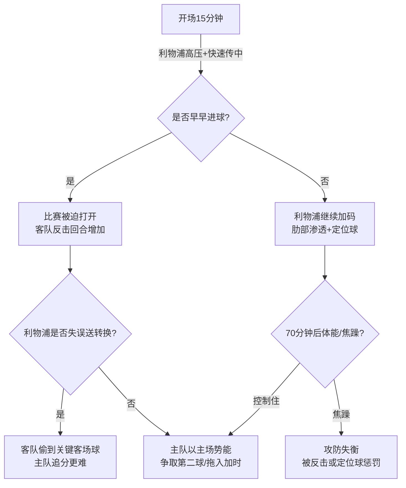

# 欧冠1/8决赛次回合赛前简报：利物浦 vs 加拉塔萨雷

- **比赛**：UEFA Champions League（欧冠）1/8决赛 次回合
- **对阵**：利物浦（Liverpool） vs 加拉塔萨雷（Galatasaray）
- **地点**：安菲尔德（Anfield）
- **开球**：**2026-03-18 20:00（GMT） / 2026-03-19 04:00（北京时间）**
- **首回合**：加拉塔萨雷 **1-0** 利物浦（首回合比分来自 NBC Sports 赛程汇总；具体进球信息需赛前再核对）

> 信息来源（赛前公开信息，可能随发布/官宣更新而变化）：
> - NBC Sports 欧冠淘汰赛赛程与首回合结果汇总（2026-03-18 抓取）
> - Evening Standard 赛前信息与伤停/预计阵容（2026-03-18 抓取）

---

## 0. 一句话结论（给忙的人）
- **利物浦的题目很清晰**：至少赢 1 球把比赛拖入加时，赢 2 球才可直接晋级；因此节奏与风险管理会比“好不好看”更重要。
- **加拉塔萨雷的答案也很清晰**：优先把禁区前沿的纵深保护做好，利用利物浦被迫压上的身后空间，靠反击与定位球把比赛切成碎片。

---

## 1. 关键信息速览表

| 维度 | 利物浦 | 加拉塔萨雷 |
|---|---|---|
| 任务 | 追分：至少 1 球 | 守优：不丢或少丢 |
| 主要变量 | 伤病影响 + “前场火力是否能从一开始就拉满” | 中卫人员（停赛）+ 反击效率 |
| 关键对位 | 利物浦右路/肋部渗透 vs 客队边路回收 | 客队反击冲刺点 vs 利物浦高位身后 |

---

## 2. 伤停与不确定性（必须标注）

> 伤停信息口径来自 Evening Standard 赛前报道；**以俱乐部最终大名单/赛前发布会为准**。

### 2.1 利物浦（待确认：是否还有新增伤停）
| 状态 | 球员 | 备注 |
|---|---|---|
| 伤缺（长期） | Alexander Isak | 报道称仍将缺阵至下月左右（待确认） |
| 伤缺（长期） | Conor Bradley / Wataru Endo / Giovanni Leoni | 报道称赛季报销/长期伤缺（待确认） |
| 出战成疑 | Joe Gomez | 报道称需要赛前测试（待确认） |

### 2.2 加拉塔萨雷
| 状态 | 球员 | 备注 |
|---|---|---|
| 伤缺 | Enes Buyuk（替补门将） | 报道称肩伤，且即便健康也大概率不出场 |
| 停赛 | Davinson Sánchez | 报道称首回合末段吃牌停赛（对后场组织与防空有影响） |

---

## 3. 近况/心理面（简版）
- **利物浦**：近期联赛出现丢分（Standard 提到对热刺 1-1，且在追求第二球时出现“更激进”的调整思路）。次回合在安菲尔德，追分压力与主场情绪会把比赛推向更高的对抗强度。
- **加拉塔萨雷**：Standard 提到近期 3-0 击败伊斯坦布尔巴萨克赛尔，前场球员（文中点名 Victor Osimhen）状态不错。

> 说明：若需“最近5场战绩（含比分）”级别的数据，应以官方赛程页/权威数据商（如 Opta、FBref）为准；本简报以可核对的公开报道为底座，避免凭空编造具体比分。

---

## 4. 可能首发（70%把握的骨架）

### 4.1 利物浦（4-2-3-1，来自 Standard 的预测）
- 门将：Alisson
- 后卫：Szoboszlai（或其他临时右后卫方案）/ Konaté / Van Dijk / Kerkez
- 后腰：Mac Allister + Gravenberch
- 前腰线：Salah / Wirtz / Gakpo
- 中锋：Ekitike

### 4.2 加拉塔萨雷（示意骨架，具体人选待确认）
- 更可能采用 **4-2-3-1 或 4-1-4-1 的回收阵型**
- 核心思路：
  - 前场保留 1–2 个速度点作为反击“出口”
  - 通过双后腰保护禁区弧顶与肋部

---

## 5. 战术对照：怎么赢（以及怎么输）

### 5.1 利物浦的三条进球路径
1) **高位压迫 + 二次进攻**：把客队长传解围变成“半场攻防演练”，靠边路传中/倒三角找点。
2) **肋部渗透**：用 Wirtz/Salah 在肋部形成小组配合，强行制造禁区内“最后一脚”机会。
3) **定位球**：在僵局下更现实的破局手段；Van Dijk/Konaté 的冲顶价值会被放大。

### 5.2 加拉塔萨雷的三条偷袭路径
1) **反击第一脚直塞**：利物浦边后卫压上后，身后空间会很大。
2) **二点球与远射**：当主队重兵压上，禁区弧顶会出现短暂空档。
3) **拖节奏**：用犯规、界外球、门将发球节奏把比赛切碎，让主队的“连续冲击”变成离散回合。

---

## 6. 关键对位清单（看球抓手）
- **Salah 的起步位置**：是贴边 1v1 还是更多内收打肋部？
- **利物浦右后卫位的选择**：若人员不整，右侧防线会成为客队反击的重点落点。
- **客队中卫/防空的应对**：Sánchez 停赛后，高空球与禁区混战的质量可能下滑（待确认替代者）。

---

## 7. 比赛脚本（最可能的 3 种）

---

## 8. 风险提示（赛前不可忽略）
- **利物浦追分的“时间压力”会诱发结构性风险**：一旦在60–75分钟仍未破门，阵型会自然前压，转换防守会变薄。
- **加拉塔萨雷的“赢法”不需要好看**：他们只需要把关键时间段（开场、半场结束前后、70分钟后）守住。

---

## 9. 观赛建议（30秒）
- 前 15 分钟看利物浦能否把客队压在禁区外 30 米并制造连续角球/二次进攻。
- 若利物浦率先进球：比赛大概率会变成“谁先犯错”的转换战。
- 若 60 分钟仍 0-0：主队会越来越冒险，客队反击威胁陡增。
