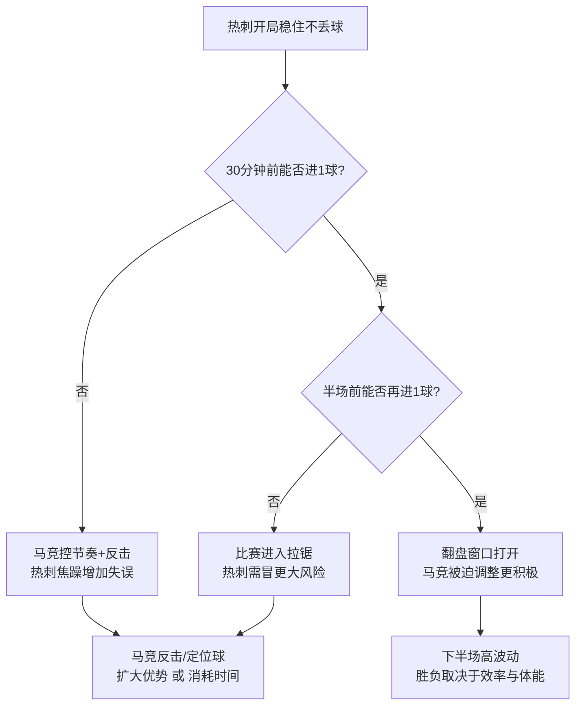

# 欧冠1/8决赛次回合赛前简报：热刺 vs 马德里竞技

- 比赛：UEFA Champions League 2025/26 1/8决赛 次回合
- 对阵：托特纳姆热刺（Tottenham Hotspur）vs 马德里竞技（Atlético de Madrid）
- 开球时间：2026-03-19 04:00（北京时间）
- 首回合：马竞 5-2 热刺（马德里，Estadio Metropolitano）

> 信息来源与时效说明：
> - 赛程与首回合比分（含首回合关键事件/进球时间）主要来自 NBC Sports 的淘汰赛赛程汇总与热刺官网首回合战报（见文末“来源”）。
> - 伤停与预测阵容来自《Evening Standard》赛前阵容文章；马竞缺阵信息来自《Marca》赛前发布会报道。
> - 个别媒体口径可能存在出入，未获官方确认的内容已标注「待确认」。

---

## 1) 一句话结论（Executive Summary）
热刺带着 **总比分2-5落后** 回到主场，理论上必须“提速+提风险”；马竞则更像一场“管理比赛”的任务：**不求控球漂亮，但要把热刺的冲击转化为反击机会**。

---

## 2) 关键数字与对局形势（摘要表）

| 维度 | 热刺 | 马竞 | 赛前含义 |
|---|---|---|---|
| 总比分压力 | 2-5落后 | 5-2领先 | 热刺需至少赢3球才可能翻盘；马竞可更务实 |
| 首回合剧本 | 早段连丢3球后崩盘 | 抓住失误打穿 | 次回合热刺必须先稳住开局 |
| 本场目标（现实） | 尽早进球、持续施压 | 控节奏+反击效率 | 先手方更怕“被扳回一球后情绪上头” |

---

## 3) 首回合复盘（决定次回合的3个点）
1. **失误成本极高**：热刺首回合开局阶段出现多次后场处理失误/滑倒等，直接导致比分快速失控。
2. **马竞的“第一波反抢→纵向推进”很致命**：一旦热刺后场被迫横传/回传，马竞能迅速把回合变成直塞/冲刺。
3. **热刺仍能通过边路制造终结**：首回合热刺由佩德罗·波罗与索兰克各入一球，说明并非完全“没路”。

---

## 4) 伤停与出场可能性（以赛前发布为准）

### 热刺（重点）
- 伤缺（Standard列出）：Ben Davies、Joao Palhinha、Mohammed Kudus、Rodrigo Bentancur、Wilson Odobert、Yves Bissouma、James Maddison、Dejan Kulusevski
- 停赛：Richarlison
- 存疑：Conor Gallagher（病毒/呼吸问题，是否能上替补待定）
- 利好：Cristian Romero 被主帅确认可出战（Standard引述）

### 马竞（重点）
- 《Marca》赛前报道提到：马竞此战有 **三名缺阵**，其中包括两位关键球员 **Jan Oblak、Pablo Barrios**，以及 **Rodrigo Mendoza**。

> 注：部分媒体对马竞门将与中场替代方案有不同预测，最终以赛前首发为准。

---

## 5) 预计阵型与可能首发（70%把握骨架；未确认处标注）

### 热刺：可能 3-4-2-1（Standard预测）
- 门将：Vicario
- 后卫：Danso、Romero、Van de Ven
- 翼卫/中场：Porro、Gray、Sarr、Spence
- 前腰/影锋：Kolo Muani、Xavi Simons
- 中锋：Solanke

**战术含义**：三中卫+双前腰更利于“压上时留后手”，但翼卫身后空间会被马竞重点针对。

### 马竞：可能 4-4-2 / 3-5-2（待确认）
- 由于 Oblak 缺阵的媒体信息较多，门将很可能调整（人选待确认）。
- 前场核心大概率仍围绕 **Griezmann / Álvarez** 的双前锋/前腰-前锋联动（基于首回合进球参与）。

---

## 6) 三条“赢球路径”（Goal Paths）

| 路径 | 热刺要做什么 | 马竞如何应对 |
|---|---|---|
| 1) 开局前15分钟不失球 | 后场出球更直接、减少横向传递；定位球争前点 | 放热刺控球但收缩中路，等热刺翼卫压上后打身后 |
| 2) 先扳回一球（60分钟前） | 边路反复形成传中/倒三角，索兰克+二点包抄 | 让热刺传中但守禁区人数；把解围变成第一脚直塞反击 |
| 3) 让比赛进入“高波动” | 高位逼抢+强对抗，争取制造马竞出球失误 | 以犯规与节奏控制切碎比赛，避免连续回合 |

---

## 7) 关键对位（你盯这4个就够了）
1. **Porro（热刺右翼）vs 马竞左侧防区**：Porro 首回合有进球，热刺右路是最可能的“可复制产线”。
2. **热刺后场第一脚（Romero/中卫）vs 马竞前压触发点（Griezmann/Álvarez）**：热刺只要再出现1-2次低级失误，比赛就结束。
3. **Solanke 的禁区内背身与二点球**：热刺追分时，二点球会比“漂亮渗透”更现实。
4. **马竞反击第一传**：领先方的“第一脚”质量决定反击是否形成单刀/定位球。

---

## 8) 比赛剧本预测（两种最可能）

### 剧本A（概率更高）：热刺强压但效率一般，马竞用反击锁死希望
- 热刺上半场压制、但迟迟不能早早破门；
- 一旦热刺压到极限，马竞用1次高质量反击/定位球“杀死”比赛悬念。

### 剧本B（翻盘窗口）：热刺先入1球 + 半场前再造混乱
- 需要热刺在前30分钟就把总比分改写到“只差2球”；
- 同时不能被马竞打出客场进球（或关键反击得手）。

---

## 9) 形势图（mermaid）

---

## 10) 风险提示（不确定性清单）
- 热刺伤停名单较长，且部分是中前场重要轮换；实际可用进攻组合可能与预测不同。
- 马竞缺少 Oblak/Barrios 的情况下，中后场组织与出球选择可能改变；具体替代人选需赛前确认。

---

## 来源（Links）
- NBC Sports：欧冠淘汰赛赛程（含 3/18 次回合场次与时间，ET）
  - https://www.nbcsports.com/soccer/news/uefa-champions-league-schedule-knockout-round-fixtures-path
- Evening Standard：热刺 vs 马竞 赛前伤停/预测阵容（含热刺预测XI与伤停）
  - https://www.standard.co.uk/sport/football/tottenham-xi-vs-atletico-madrid-confirmed-team-news-predicted-lineup-injury-latest-champions-league-b1275287.html
- Marca：西蒙尼赛前发布会报道（提到 Oblak、Barrios、Mendoza 缺阵）
  - https://www.marca.com/futbol/atletico/2026/03/17/69b98c0bdd250404cba149b3-directo.html
- Tottenham Hotspur 官方：首回合战报（含进球者、比分与关键过程）
  - https://www.tottenhamhotspur.com/news/2026/march/atletico-madrid-v-spurs-champions-league-first-leg-match-report-march-2026/
