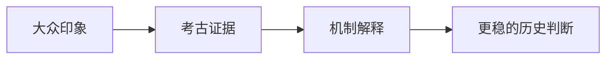

# {{SERIES_TITLE}}：{{BUNDLE_TITLE}}

大家好，我是鲸鱼老师！【先用一段完整导语说明：这讲最值得看的是什么，为什么它不是一个简单常识题，而是一个更深的历史机制问题。】

<!-- 正文结构应与 briefing-card.md 对齐。根据需要复制或删除 H2 小节。 -->
<!-- 这不是纯 prose 文章。优先考虑表格、mermaid、图片、思维导图、公式、代码或 schema 片段来承载较密的知识内容。 -->

---

## 一眼读懂

| 模块 | 建议内容 |
| --- | --- |
| 本讲核心判断 | 【用一句话说清整讲结论】 |
| 关键证据 | 【列出 2 到 4 个证据抓手】 |
| 最易误解点 | 【指出一个最常见误读】 |

## 一、问题提出

【说明这一讲的核心历史问题。不要只提问，要先交代大众印象，再指出真正问题在哪里。】

## 二、证据链一

【展开第一条证据链。写清材料、观察、解释和意义。必要时加入图片、表格或器物信息卡。】

## 三、机制推进 / 争议修正

【继续推进下一条论证，或处理一个常见误解 / 争议点。这里优先用对照表、流程图、思维导图或公式帮助解释。】

## 四、证据补强 / 结构转折

【补入另一条关键材料，或者把前面证据提升到更大的制度、空间或时代结构里。必要时加入时间线、人物关系或地图式说明。】

## 五、总结

【收束全文，并给出过渡或互动。要让没看简报卡片的读者也能完整理解本集结论。这里可以加入“研究框架”或“带走的判断规则”。】

<!-- 根据卡片规划继续复制 H2 小节。最后一节负责收束全文，并给出过渡或互动。要让没看简报卡片的读者也能完整理解本集结论。 -->

---
*版权说明：本文为《鲸鱼老师讲历史》章节简报工作稿，请在定稿前补齐来源说明。*
