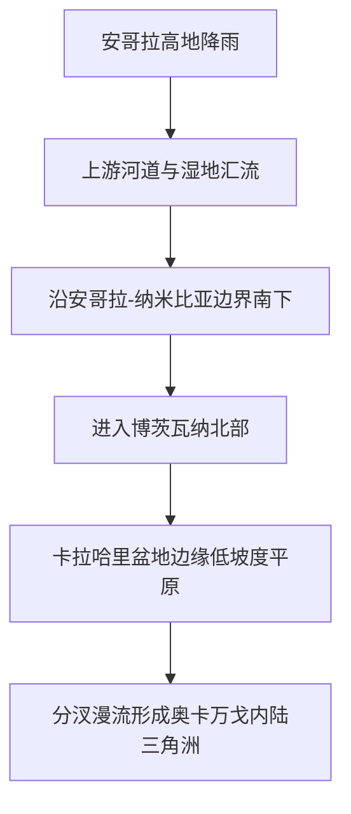

# 沙漠中的呼吸——奥卡万戈三角洲为何不入海却能在旱地盛开

大家好，我是鲸鱼老师！

如果你第一次看到奥卡万戈三角洲的卫星图，大概率会先怀疑一件事：这是不是画错了？因为按常识，三角洲应该长在海边，河流应该越流越接近海洋，最后在河口摊开沉积物。可奥卡万戈偏偏相反——它在非洲南部干旱的卡拉哈里腹地散开，在最该缺水的地方，长出一整套沼泽、草地、林岛和季节性洪泛区。

这正是奥卡万戈的地理奇迹：它是一座典型的**内陆三角洲**。它告诉我们，河流并不一定都要奔向大海；当坡度、盆地、气候和沉积条件组合得足够特别，一条河也可能在内陆完成自己的“展开”。

## 一眼读懂

| 问题 | 奥卡万戈的答案 |
|---|---|
| 为什么三角洲不在海边？ | 因为河流进入卡拉哈里盆地边缘后，在低坡度内陆平原上分汊漫流，形成内陆三角洲 |
| 水从哪里来？ | 主要来自安哥拉高地降雨，而不是博茨瓦纳本地降雨 |
| 为什么旱季反而来洪水？ | 洪峰沿极缓坡度、曲折水道传播很慢，往往几个月后才抵达下游 |
| 为什么大多数年份不入海？ | 水在湿地网络中被蒸散、渗漏和分汊耗散，常态下无法形成稳定对海输出 |
| 为什么生态价值极高？ | 旱季补水 + 多样湿润梯度，形成大型动物、鸟类、鱼类和人类活动共存的湿地镶嵌体 |
| 真正的风险是什么？ | 不是单纯“少水”，而是来水节律、漫溢路径和跨境走廊连通性被破坏 |

## 卡片1｜三角洲，为什么会开在沙漠里？

“内陆三角洲”这个词本身就带着一点反常识意味。普通三角洲通常发生在河流靠近海洋、流速下降、泥沙堆积的河口地带；而奥卡万戈位于博茨瓦纳北部，远离海洋，却同样形成了巨大的扇形湿地展开面。

它之所以仍然叫“三角洲”，并不是因为它和海边三角洲完全一样，而是因为它同样表现出分汊、漫流、沉积与空间扇展的结构特征。不同之处在于，它的终点不是海，而是一块足够平、足够浅、足够沙、足够热的内陆盆地边缘。

也就是说，奥卡万戈不是“没走到海边的失败河流”，而是一条在内陆完成展开任务的成功河流。

## 卡片2｜一条跨三国而来的水：高地喂养旱盆地

奥卡万戈的第一层地理逻辑，是它的水源与受益区分离。上游主要来水区位于安哥拉高地，这里降雨更充足、地势更高；随后河流向南流动，经过安哥拉与纳米比亚边界附近区域，进入博茨瓦纳北部。

这个空间链条很重要，因为它不是“本地下雨、本地成湖”的封闭系统，而是一个典型的跨境流域系统：

当水流进入低坡度、沙质广布的平原时，河流的行为就开始改变。它不再像山地河流那样集中切割、快速前冲，而是不断减速、外溢、分汊。空间上看，这是一条从“高地集水通道”转入“盆地分散湿地网络”的河。

## 卡片3｜洪峰为什么总在旱季到？

奥卡万戈最迷人的水文机制，是它的**延迟洪峰**。安哥拉高地在雨季降下的大量降水，并不会马上出现在博茨瓦纳北部的湿地里。原因很简单：这条河走得太慢了。

NASA 和相关遥感资料反复强调一点：上游降雨进入系统后，要沿着曲折河道和极其平缓的坡度传播，常常几个月后才到达下游。所以当博茨瓦纳本地进入旱季，奥卡万戈的洪峰反而逐渐铺开。

这个机制可以简化为：

$$
\text{湿地生命力} \approx \text{上游降雨量} \times \text{洪峰延迟传播} \times \text{下游旱季需求匹配}
$$

这不是严格的物理公式，但它抓住了节目里最该讲清的一点：奥卡万戈之所以珍贵，不只是因为“有水”，而是因为它把水送到了最该到的时候。

## 卡片4｜为什么不入海：水被湿地系统“分掉”了

“奥卡万戈不入海”这句话容易被说得过于绝对。更准确的表达应该是：**常态下，奥卡万戈的大部分水量在内陆湿地系统中被耗散，难以形成稳定而持续的对海输出。**

它不入海，主要不是因为前方有一堵墙，而是因为前方是一整套会把水逐层摊薄的系统：

1. 河道分汊，主流被拆成许多支流与浅水通道；
2. 大片洪泛平原和沼泽把水摊开，降低前进效率；
3. 炎热气候下蒸发和植物蒸腾持续消耗水量；
4. 沙质地表和地下介质让部分水继续向下渗漏。

可以把它想成一张巨大的湿地滤网：水不是突然消失，而是在无数小尺度过程里被一点点耗散。

下表能更直观看出它和典型河口三角洲的差别：

| 对比项 | 典型河口三角洲 | 奥卡万戈内陆三角洲 |
|---|---|---|
| 终点 | 海洋或大型水体 | 内陆盆地边缘 |
| 主导过程 | 河海交汇、沉积扩张 | 分汊漫流、蒸散与渗漏 |
| 水流目标 | 对海输出 | 对内陆湿地展开 |
| 洪泛意义 | 河口地貌塑造 | 湿地生态维持 |
| 结局 | 入海 | 常态下不入海，局部高水年可外联 |

所以严格讲，奥卡万戈不是“完全没有出口”，而是“出口从来不是这套系统的常态命运”。

## 卡片5｜为什么这里会成为动物与人的黄金走廊？

如果只有一条主河道，奥卡万戈不会有今天这样的生态地位。它真正强大的地方在于：这里不是单一湿地，而是一整套从永久沼泽、季节洪泛区、草地、林岛到边缘干地的湿润梯度。

这套梯度意味着什么？意味着生命可以按水位分工。

- 鱼类依赖稳定水道与漫滩补给；
- 鸟类利用浅滩、芦苇和开阔水域；
- 大型食草动物会在旱季向有水地带集中；
- 捕食者则跟着食草动物移动；
- 人类的独木舟交通、聚落位置和旅游线路，也围绕这套水网组织。

这也是为什么奥卡万戈长期被视为南部非洲最重要的生命走廊之一：它不是一个孤立的景点，而是一个让流动继续发生的空间系统。

## 卡片6｜真正脆弱的，是它的呼吸节奏

很多湿地保护讨论会先问：未来会不会少水？这当然重要，但对于奥卡万戈，还不够。因为它最关键的财富是节律。

如果上游开发改变了汇流方式，或者围栏、道路和土地利用改变了走廊连通性，那么问题不只是“少了多少水”，而是：

- 洪峰什么时候到？
- 会从哪条通道漫出来？
- 哪些湿地先被喂饱，哪些会先干掉？
- 动物还能不能按老路线迁徙？

这就解释了为什么保护奥卡万戈不能只盯着博茨瓦纳境内的那片湿地，而必须把它当成一个从安哥拉高地一路连下来的跨境系统去看。水塔、河道、湿地、走廊和人类利用方式，实际上是同一套地理机器的不同零件。

### 结语：它不是一条失败的河，而是一条完成了另一种使命的河

奥卡万戈最动人的地方，在于它打破了我们对河流命运的单一想象。不是所有河流都要奔向海洋。有些河流，会在内陆把自己摊成一片湿地；有些河流的价值，不在终点，而在展开过程本身。

在卡拉哈里这样本该干燥的地方，奥卡万戈靠一套迟到却精准的洪峰、缓慢却持久的漫流、分散却高效的湿地网络，养活了一个庞大的生命共同体。它不是“沙漠里的例外”，而是地理系统如何通过节律达成平衡的绝佳教材。

### 来源说明

本文依据 UNESCO 世界遗产资料、NASA Earth Observatory、USGS、National Geographic Education 及相关保护报道整理。涉及面积、洪峰时间与对外连通性等表述均采用“约”“常态下”“高水年例外”等谨慎表达，以避免把年际波动系统写成静止常数。