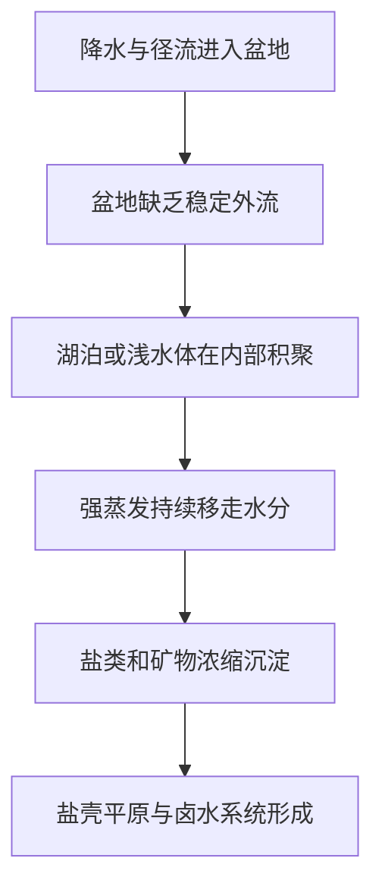

# 天空之镜——乌尤尼盐沼为什么能在最干旱的高原上变成一片海

大家好，我是鲸鱼老师！

如果有一种地表景观，能让你站在上面时几乎分不清脚下和天空的边界，那大概率就是乌尤尼盐沼。它位于玻利维亚阿尔蒂普拉诺高原，平时是一片白得刺眼、干得发脆的盐壳平原；可一到雨季，薄薄一层积水铺开，整片地表突然像一面无边无际的镜子，把云、光和人影全都收进去。

但乌尤尼真正值得讲的，不只是“好看”。它其实是一个地理系统的压缩样本：封闭流域如何积累盐类，古湖如何退成盐壳，极平地表为什么能制造镜面幻觉，而能源转型时代的锂资源开发，又如何把一片风景变成一张现实考卷。

## 一眼读懂

| 问题 | 乌尤尼的答案 |
|---|---|
| 为什么这里会有这么大的盐沼？ | 因为它位于安第斯高原封闭流域中，古湖退缩后水走了、盐留下来 |
| 为什么能变成“天空之镜”？ | 雨季薄层积水铺在极平整的盐壳表面上，形成连续反射 |
| 为什么这里特别平？ | 长期盐类沉淀、封闭盆地环境和大尺度平坦地表共同塑造了高均一度表面 |
| 为什么它和锂联系紧密？ | 盐壳之下的卤水富含锂等资源，是当代能源转型关注焦点 |
| 最大争议是什么？ | 资源开发、旅游扩张与高原脆弱水系统之间的平衡 |

## 卡片1｜白色高原，为什么会突然变成一片海？

乌尤尼最容易制造的错觉，是让人忘记它首先是一片“盐沼”。因为当雨季水层足够薄、足够连续时，整片地表会变成几乎没有边界感的镜面，视觉上像一片被铺平的天空。

这种景象的反常识之处在于：它发生在一个高寒、干旱、封闭的高原盆地里，而不是发生在温暖潮湿的海岸或丰水湖区。也正因此，乌尤尼不是“偶然好看”的旅游景点，而是蒸发主导地理环境的教科书级案例。

## 卡片2｜一座被高原围住的封闭盆地

乌尤尼位于玻利维亚阿尔蒂普拉诺高原，海拔约 3656 米。这里最关键的地理条件，不只是高，而是**封闭**。

在封闭流域里，水进入盆地后没有稳定外流通道，意味着它最终只能通过蒸发离开系统。与开放流域相比，封闭盆地更容易保留盐类、矿物和古水体痕迹，因为水走得掉，溶解物却走不掉。

这个逻辑可以简化成一条非常关键的地理链条：

乌尤尼的命运，就是被这条链条一步步塑造出来的。

## 卡片3｜它不是海留下的，而是一座古湖退出来的地表记忆

很多人会把大盐沼和古海联系起来，但乌尤尼更适合被理解为**古湖退缩的遗迹**。在晚第四纪较湿润阶段，这一带曾存在更大范围的湖泊系统。后来气候逐渐变干，湖面不断收缩，留下更浓的盐水和越来越厚的蒸发沉积。

于是，乌尤尼的“白”并不是空白，而是蒸发之后的残留。每一次湖面退后，都会把更多盐类和矿物沉淀在地表；长时间叠加之后，才形成今天这种极广阔的盐壳。

可以把这个过程理解为：

$$
\text{盐壳累积强度} \approx \text{封闭程度} \times \text{蒸发强度} \times \text{时间长度}
$$

这不是精确公式，但它很好地表达了乌尤尼形成的核心逻辑：水离开得越稳定，盐留下得就越彻底。

## 卡片4｜天空之镜为什么成立？

“天空之镜”真正成立，靠的是三个条件同时出现：

| 条件 | 作用 |
|---|---|
| 极平整盐壳 | 提供连续反射基底 |
| 薄而连续的积水 | 形成镜面而非深水波浪 |
| 合适的风和降水条件 | 决定镜面是否完整、稳定 |

当雨季到来，一层很浅的水覆盖在极平整地表上，天空就会在脚下重复一次。由于视线中缺少明显起伏，地平线会变模糊，倒影和实体之间的边界感被削弱，于是观者会产生“天地相接”的感受。

所以乌尤尼像海，不是因为它真的成了深湖，而是因为浅水 + 超平地表完成了一次视觉欺骗。

## 卡片5｜盐壳之下，为什么会成为锂时代的前线？

乌尤尼的第二重现实在地下。盐壳之下的卤水富含锂、钾、镁、硼等元素，尤其是锂，使它在当代能源转型中拥有极高关注度。问题在于，这不是普通固体矿床，而是和水文过程深度绑定的卤水资源。

这意味着资源开发并不只是“采矿”，而是在重写一套水—盐—蒸发系统：

- 需要抽取卤水；
- 需要蒸发浓缩；
- 需要建设道路、池体和工业设施；
- 可能改变局部水量分配和地表—地下的交换关系。

因此，乌尤尼的开发争议本质上不是“要不要发展”，而是“在一个极端缺水、极端脆弱、又极端平坦的高原封闭盆地里，发展可以改写到什么程度”。

## 卡片6｜未来要守住的，是一面镜子还是一套水系统？

乌尤尼常被消费成一种纯视觉奇观：白色、极简、无限反射。但从地理角度看，它真正稀缺的不是“好看”，而是它所代表的系统完整性。

旅游看中镜面，产业看中锂，地方社会关心水与生计，而气候变化又会改变降水时序、积水范围和可达性。换句话说，大家盯着的是同一片地表，但争夺的是完全不同的未来。

这也是乌尤尼最值得在《水的史诗》里讲的一点：在蒸发主导环境中，水即便少得像幻觉，也足以决定景观、资源和政治。看上去最像“空白”的地方，往往最密集地写满了人地关系。

### 结语：一片像幻觉的风景，其实最讲现实

乌尤尼盐沼之所以震撼，不只是因为它像一面镜子，而是因为这面镜子照出来的，不只有天空，还有一个时代的资源选择。它让我们看到：封闭流域如何保留古水体记忆，蒸发如何塑造地表奇观，而所谓“绿色未来”又如何在源头提出新的水环境问题。

### 来源说明

本文依据 Britannica、NASA Earth Observatory、USGS 公开资料，以及近年关于乌尤尼锂开发与社区争议的新闻与学术摘要整理。涉及古湖阶段、资源量与开发计划的部分采用谨慎表述，避免把仍在变化中的项目和研究结论写成静态定论。