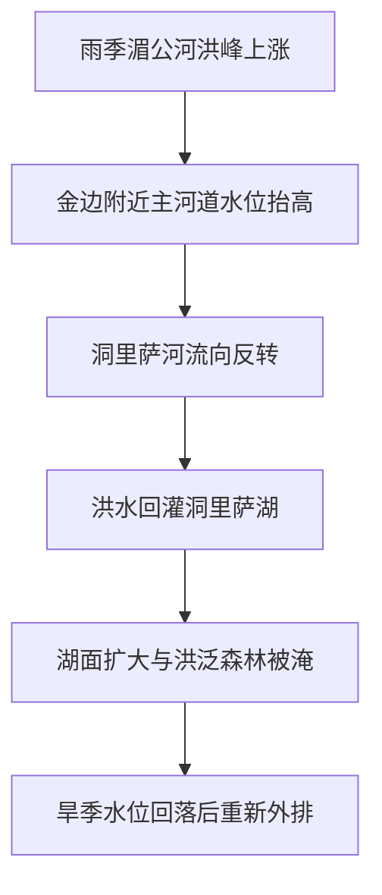

# 逆流之湖——洞里萨湖如何让一条河在季风里倒着流

大家好，我是鲸鱼老师！

如果说很多湖泊是被河流喂养出来的，那么洞里萨湖更像是和河流进行了一场全年拉扯。平时，它通过洞里萨河把湖水向南排进湄公河；可一到雨季，情况却会完全反过来——湄公河洪水抬高水位，把这条河顶得倒着流，反而把水重新送回湖里。

这不是一个猎奇段子，而是东南亚季风地理的经典场景。洞里萨真正重要的地方，不只是“会逆流”，而是这套逆流机制如何把湖泊、洪泛森林、鱼类、浮村和粮食系统全部绑在一起，变成一座会呼吸的季风调蓄盆地。

## 一眼读懂

| 问题 | 洞里萨的答案 |
|---|---|
| 为什么一条河会倒流？ | 雨季湄公河洪峰抬高交汇点水位，迫使洞里萨河逆向回灌湖泊 |
| 湖面为什么暴涨暴缩？ | 湿季吸洪入湖，旱季再通过同一条河缓慢排回湄公河 |
| 为什么这里渔业特别强？ | 洪泛森林与浅水区为鱼类繁殖、觅食和迁徙提供了关键空间 |
| 为什么这里的人类生活特别依赖水位？ | 浮村、交通、生计和聚落布局都围绕涨退水节律组织 |
| 最大风险是什么？ | 不是单一“少水”，而是逆流规模、洪泛持续期和系统节律被改写 |

## 卡片1｜为什么一条河会在雨季倒着流？

洞里萨最打破常识的一点，是它把“河流总往一个方向流”这个基本印象直接推翻了。平时，洞里萨河把湖水向南送往湄公河；但一到季风洪水季，湄公河主河道水位被整体抬高，反过来把洞里萨河顶回去，水流改道进入湖中。

也就是说，洞里萨河逆流不是“逆天而行”，而是更大的主河水位把局部高程关系重新排序之后的结果。这里改变的不是重力本身，而是水面坡度在不同季节中的方向。

## 卡片2｜一座和湄公河绑在一起的湖

洞里萨湖位于柬埔寨中部，通过洞里萨河与金边附近的湄公河主河道连接。这个地理关系意味着：它并不是一个只靠本地集水区运转的封闭湖泊，而是湄公河系统的一部分。

这个关系可以简化为：

这张流程图背后真正重要的一点是：洞里萨的命运从来不是“一个湖自己怎么变”，而是“整个湄公河中下游在季风里怎样把它推着变”。

## 卡片3｜季风一来，主河把支河顶回去了

在雨季，湄公河洪峰会先在主河道上形成明显抬升。由于洞里萨河与主河相连，这种抬升一旦超过洞里萨湖一侧的水位条件，洞里萨河就失去正常泄水能力，转而变成一条回灌通道。

于是，洞里萨湖开始迅速吸纳来自湄公河的洪水，湖面和水量都显著扩大。到了旱季，主河水位下降，洞里萨河重新恢复向南流动，把湖中的蓄水慢慢送回湄公河。这个“湿季吸入、旱季排出”的过程，让洞里萨像一座天然的季风蓄洪肺。

可以把它概括为：

$$
\text{逆流触发} \approx \text{湄公河洪峰水位} - \text{洞里萨湖外排水位条件}
$$

这不是精确水动力方程，但足够表达节目里最重要的机制：逆流不是湖自己发脾气，而是主河道洪峰把坡度方向改写了。

## 卡片4｜逆流为什么会变成鱼仓和粮仓？

洞里萨之所以被称为世界级内陆渔业系统，不是因为它常年都大，而是因为它在关键季节会变大。湿季扩湖把大片低地和洪泛森林转成浅水环境，这些区域恰恰是鱼类繁殖、觅食和幼体生长的关键空间。

下表可以帮助理解它的生产逻辑：

| 季节过程 | 生态效果 | 人地意义 |
|---|---|---|
| 湿季逆流入湖 | 扩大水域与洪泛森林 | 提供繁殖与觅食空间 |
| 高水位维持 | 营养物质与生境增加 | 支撑鱼类与湿地生物量 |
| 旱季退水回河 | 生物量重新汇入主河网络 | 提高渔获与区域食物供给 |

也就是说，洞里萨不是“有鱼所以重要”，而是“正因为它会按季风规律扩湖和退湖，才有能力持续生产鱼”。

## 卡片5｜浮村、渔民和房子，都在跟着水位迁移

洞里萨的人类地理同样建立在这套节律上。浮村、船只、季节性航道、房屋结构和渔业作业方式，都会随着水位变化而重新组织。这里的人不是在一片稳定湖边生活，而是在一座不断呼吸的湖上生活。

因此，洞里萨是观察“动态人地系统”的理想样本：

- 水位决定道路；
- 水位决定渔场；
- 水位决定居住方式；
- 水位决定社区风险暴露程度。

一旦逆流减弱、鱼类减少或者低水位持续，冲击就不会停留在生态层面，而会立刻传导到家庭收入、食物结构和社区稳定性。

## 卡片6｜真正危险的，是节律被改写

今天围绕洞里萨最大的担忧，不只是某一年湖面偏小，而是整个洪泛节律正在承压。上游水坝可能改变洪峰过程和泥沙输送，气候异常会让丰枯更不稳定，低水位和洪泛森林退化又会反过来压缩鱼类栖息空间。

这意味着洞里萨面临的不是单点危机，而是一条完整链条的同步受压：

- 洪峰变了；
- 逆流变了；
- 洪泛森林状态变了；
- 鱼类资源和社区生计也跟着变了。

### 结语：河流一旦倒着流，改变的是整个地区的生活秩序

洞里萨湖的真正震撼，不在于“逆流”本身有多猎奇，而在于它让我们看见：水文节律一旦改变，湖泊、森林、鱼类、村庄和餐桌会一起改变。它是一堂非常典型的地理课——地理从来不是静态背景，而是一个地区生活秩序的运行方式。

### 来源说明

本文依据 Britannica、Mekong River Commission、UNESCO 以及近年关于洞里萨生态压力与渔业变化的机构资料和报道整理。涉及面积扩张倍数、鱼产量和风险归因等内容采用谨慎表达，避免把年际波动或多因素问题简化为单一结论。